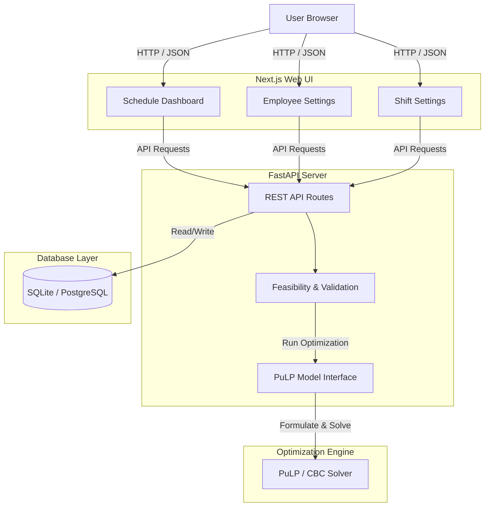
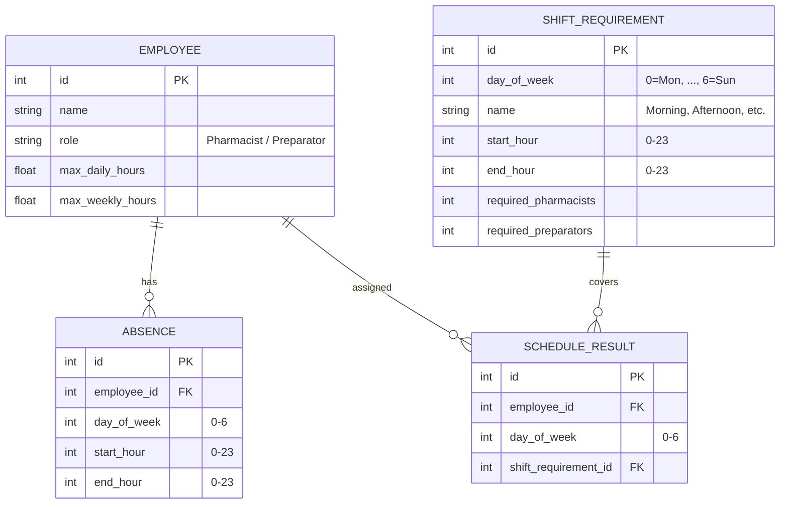

# Pharmacy Employee Schedule Planner Implementation Plan

This project builds a web-based scheduling application for pharmacies. The schedule optimization will use Mixed-Integer Linear Programming (MILP) via the `PuLP` library in Python.

## User Review Required

> [!IMPORTANT]
> - **Optimization Engine**: We will use `PuLP` to formulate and solve the weekly employee scheduling model.
> - **Database**: SQLite by default for easy local development, but using SQLAlchemy so it can easily connect to an online PostgreSQL database via an environment variable.
> - **Authentication/Multi-Tenancy**: Completely removed. No login, signup, or tenant isolation is required.

## Example Data Formats (Translated from French)

Based on the specifications and French sample files, here are the formats of the data the application will import, validate, and display.

### 1. Operating Hours & Shifts
Defines when the pharmacy is open and the available shift blocks (which can overlap, e.g., overlapping by 3 hours in the middle of the day).

**Pharmacy Open Hours (Monday - Saturday)**: `08:00 - 21:00`

**Available Daily Shifts**:
*   **Morning Shift**: `08:00 - 16:00` (8 hours)
*   **Afternoon Shift**: `13:00 - 21:00` (8 hours)

### 2. Hourly Staffing Requirements
Defines the minimum staff of each role required during each hourly block.

| Hour Block | Required Pharmacists | Required Preparators |
| :--- | :---: | :---: |
| 08:00 - 09:00 | 1 | 2 |
| 09:00 - 10:00 | 1 | 2 |
| 10:00 - 11:00 | 2 | 3 |
| 11:00 - 12:00 | 2 | 3 |
| 12:00 - 13:00 | 2 | 3 |
| 13:00 - 14:00 | 1 | 2 |
| 14:00 - 15:00 | 1 | 2 |
| 15:00 - 16:00 | 1 | 1 |
| 16:00 - 17:00 | 1 | 2 |
| *etc. (until 21:00)* | ... | ... |

### 3. Employee Weekly Hours
The contract/target hours per employee, which can vary week-to-week.

| Employee | Role | Week 1 Hours | Week 2 Hours | Week 3 Hours |
| :--- | :--- | :---: | :---: | :---: |
| Pharmacist A | Pharmacist | 36 | 34 | 26 |
| Pharmacist B | Pharmacist | 33 | 34 | 39 |
| Pharmacist C | Pharmacist | 36 | 26 | 29 |
| Preparator A | Preparator | 32 | 40 | 30 |
| Preparator B | Preparator | 36 | 34 | 28 |
| Preparator C | Preparator | 39 | 32 | 25 |

### 4. Example Output Table (Monday Schedule)
Shows which employees are assigned to which shifts for a given day.

| Employee | 08:00 - 16:00 Shift | 12:00 - 20:00 Shift |
| :--- | :---: | :---: |
| Pharmacist A | **X** | |
| Pharmacist B | | **X** |
| Pharmacist C | **X** | |
| Preparator A | | **X** |
| Preparator B | **X** | |
| Preparator C | **X** | |

---

## Technical Architecture

The application follows a standard three-tier architecture:
1. **Frontend (Next.js / React)**: Handles user interaction, form inputs, configuration displays, and grid visualizations of schedules.
2. **Backend (FastAPI)**: Implements REST APIs, input data validation, and handles model creation and interface logic for the solver.
3. **Solver (PuLP + CBC)**: The mathematical engine that models and solves the linear program.
4. **Database (SQLAlchemy + SQLite/PostgreSQL)**: Stores employee records, shifts, absences, and the generated schedules.

## Database Details

The schema consists of four tables managing employees, shift configurations, absences, and the generated outputs:

---

## Optimization Model Formulation (PuLP)

We use the **PuLP** library in Python to formulate a Mixed-Integer Linear Programming (MILP) model.

### Variables
- Let $y_{e, s} \in \{0, 1\}$ be a binary decision variable indicating whether employee $e$ is assigned to shift $s$.
- Let $x_{e, d, h} \in \{0, 1\}$ be the binary status indicating if employee $e$ works on day $d$ at hour $h$.
  - If employee $e$ is assigned to shift $s$, then $x_{e, d_s, h} = 1$ for all hours $h$ from $start_s$ to $end_s$.

### Constraints
1. **Shift Structure & Overlap Constraint**:
   - An employee cannot be assigned to overlapping shifts on the same day. For any two shifts $s_1$ and $s_2$ that overlap on day $d$:
     $$y_{e, s_1} + y_{e, s_2} \le 1 \quad \forall e$$

2. **Total Weekly Hours Constraint**:
   - The total hours assigned to employee $e$ in a week must not exceed their weekly limit $W_e$:
     $$\sum_{s} y_{e, s} \times (end_s - start_s) \le W_e \quad \forall e$$

3. **Max Hours Per Day Constraint**:
   - The total hours assigned to employee $e$ on day $d$ must not exceed their daily limit $D_e$:
     $$\sum_{s \text{ on day } d} y_{e, s} \times (end_s - start_s) \le D_e \quad \forall e, d$$

4. **Absence Constraint**:
   - If employee $e$ has a planned absence during any hour of shift $s$, they cannot be assigned to that shift:
     $$y_{e, s} = 0$$

5. **Staffing Requirements Constraint**:
   - For each shift $s$:
     - Number of assigned pharmacists must meet or exceed the requirement:
       $$\sum_{e \in Pharmacists} y_{e, s} \ge req\_pharmacists_s$$
     - Number of assigned preparators must meet or exceed the requirement:
       $$\sum_{e \in Preparators} y_{e, s} \ge req\_preparators_s$$

### Objective Function
To ensure we find a feasible schedule:
- **Minimize** total scheduled working hours:
  $$\text{Minimize } \sum_{e, s} y_{e, s} \times (end_s - start_s)$$

---

## User Interface Design

The application features a modern, responsive dashboard:
1. **Sidebar Navigation**: Switch between:
   - **Schedule**: Interactive calendar view showing generated assignments.
   - **Employees**: Form to add/remove employees and register planned absences.
   - **Shifts**: Form to define shift timings and role staffing requirements.
2. **Interactive Calendar Grid**:
   - Displays all configured shifts along the top.
   - Displays employees down the side.
   - Shows checkmarks (`✓`) where assignments are created, and `—` where employees are free.
3. **Optimization Control**:
   - A **Validate Inputs** button to run feasibility checks (checking if the total available employee hours meet the minimum required shift hours).
   - A **Generate Schedule** button that runs the optimizer and refreshes the calendar grid in real time.

---

## Proposed Changes

### [Backend] FastAPI & PuLP Optimization Engine
The backend will manage database models, validate inputs, and run the PuLP solver.

#### [NEW] [database.py](file:///Users/alena/sipha-project/backend/database.py)
- SQLAlchemy database engine setup (SQLite default with environment variable fallback for PostgreSQL).

#### [NEW] [models.py](file:///Users/alena/sipha-project/backend/models.py)
- `Employee`: Name, Role (Pharmacist/Preparator), Max Daily Hours, Max Weekly Hours.
- `ShiftRequirement`: Configured shifts per day (Start/End times, Required Pharmacists/Preparators).
- `Absence`: Planned absences for employees.
- `Schedule`: Generated schedule records.

#### [NEW] [optimizer.py](file:///Users/alena/sipha-project/backend/optimizer.py)
- Formulates the scheduling problem as a MILP using `PuLP` and solves it using CBC.
- Decision variables: $y_{e, s} \in \{0, 1\}$ (employee $e$ works shift $s$).
- Constraints: Max daily hours, max weekly hours, shift coverage requirements, absences, and one-shift-per-day rule.
- Objective: Minimize total hours worked (meets requirements cost-effectively).
- **Validation and Feasibility Pre-checks**:
  - Compares total available weekly hours of employees against shift requirement demands.
  - Verifies shift-specific coverage against non-absent staff.
  - Catches solver infeasibility errors and returns a clean, descriptive message explaining why scheduling is not possible under the current constraints.

#### [NEW] [main.py](file:///Users/alena/sipha-project/backend/main.py)
- API routes for `/employees`, `/shifts`, `/absences`, and `/optimize`.
- Returns detailed HTTP validation errors if the input data fails pre-checks or the solver is infeasible.

#### [NEW] [seed_demo.py](file:///Users/alena/sipha-project/backend/seed_demo.py)
- Seeding script to populate the database with a standard test dataset:
  - 3 Pharmacists, 4 Preparators.
  - 2 Overlapping planned absences (Pharmacist A on Monday, Preparator B on Tuesday).
  - 12 Shifts (Monday - Saturday) with 1 Pharmacist and 1 Preparator requirement (generating a feasible 24-slot schedule).

### [Frontend] Next.js Application
A premium, responsive scheduling dashboard.

#### [NEW] [pages/index.tsx](file:///Users/alena/sipha-project/frontend/pages/index.tsx)
- Dashboard showing the active week's schedule, optimization triggers, and key stats.

#### [NEW] [pages/employees.tsx](file:///Users/alena/sipha-project/frontend/pages/employees.tsx)
- Employee management screen (Add/Edit staff, set weekly/daily hour limits, and log absences).

#### [NEW] [pages/settings.tsx](file:///Users/alena/sipha-project/frontend/pages/settings.tsx)
- Setting shift operating hours and hourly staffing requirements for Pharmacists and Preparators.

#### [NEW] [styles/globals.css](file:///Users/alena/sipha-project/frontend/styles/globals.css)
- Sleek modern design system: dark/light colors, glassmorphism cards, schedule calendar grids, and styling for validation buttons, loaders, and warning alert states.

---

## Verification Plan

### Automated Tests
- Test cases for `optimizer.py` verifying constraints under various scenarios (e.g. overlapping absences, insufficient staff).
- API endpoint integration tests validating correct error codes on infeasibility.

### Manual Verification
- **Local Application Testing URLs**:
  - **Frontend Web UI**: [http://localhost:3000](http://localhost:3000)
  - **Backend API Docs (Swagger)**: [http://localhost:8000/docs](http://localhost:8000/docs)
- **Seeding Demo Data**: Run `PYTHONPATH=backend python3 backend/seed_demo.py` to reset the database to a fresh, feasible demo dataset (3 pharmacists, 4 preparators, 2 absences).
- Verify database persistence (employees and configuration remain after refresh).
- Verify optimization results match requirements.
- **Feasibility Test**: Intentionally create an impossible constraint scenario (e.g., require 3 pharmacists for a shift when only 1 is registered), click the **Validate Input Data** button, and confirm the UI displays a descriptive warning alert and disables the **Generate Schedule** button.
- **Successful Generation**: Setup a valid scenario, click **Validate**, confirm the success banner appears, and then click **Generate Schedule** to verify the output matches the expected shifts.
