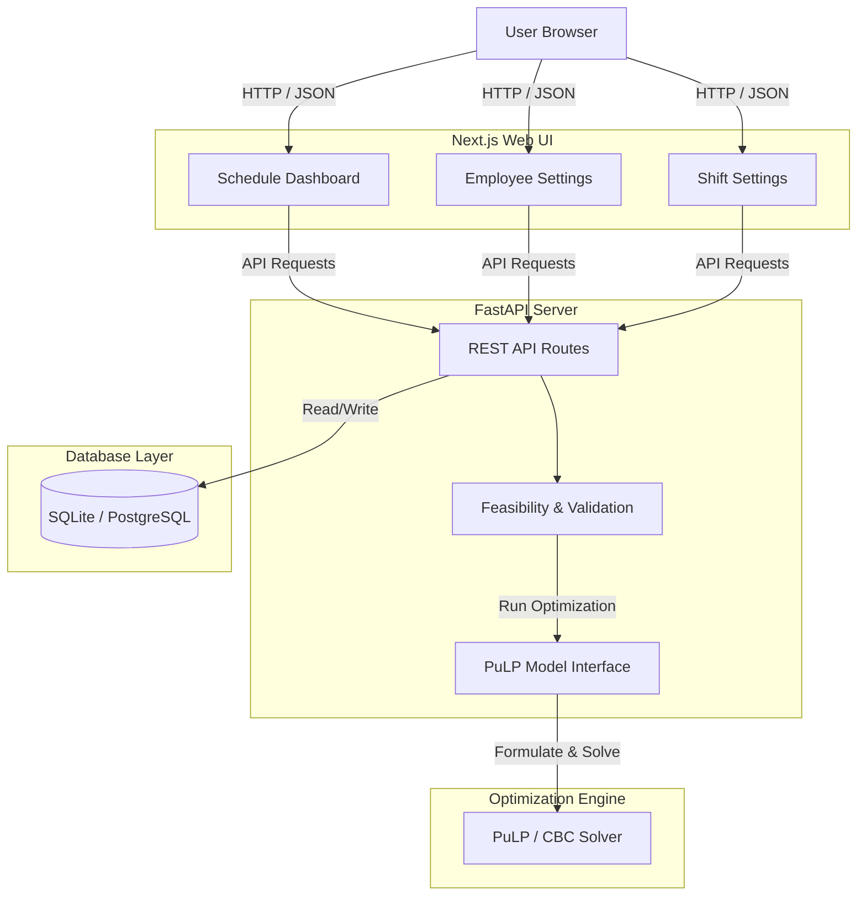
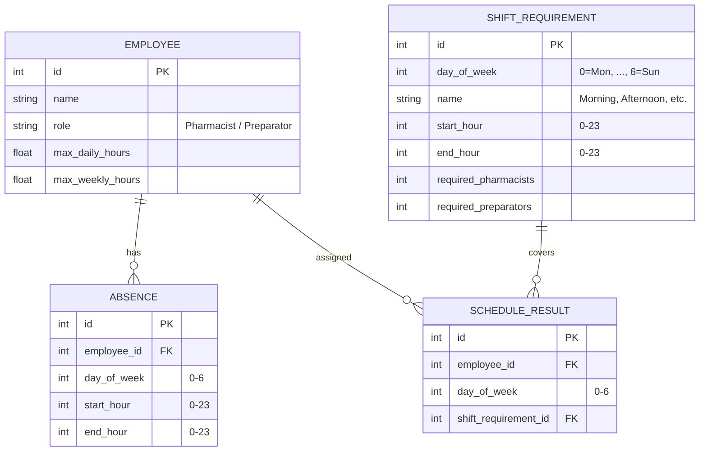

# PharmaRoster: Intelligent Pharmacy Scheduling & Staffing Optimization
### A Full-Stack Mixed-Integer Linear Programming Web Application

---

## 1. Executive Summary
**PharmaRoster** is a web-based, automated shift-scheduling application designed specifically to solve the complex constraints of pharmacy staffing. Pharmacy managers face severe difficulties when planning weekly schedules: they must coordinate employee daily and weekly contract limits, account for planned employee absences, and enforce strict, role-based staffing requirements (such as having a minimum number of licensed Pharmacists vs. Preparators active during any given shift).

To solve this, PharmaRoster introduces a mathematically optimized scheduling engine built with Python and **PuLP** (a Mixed-Integer Linear Programming library) combined with a modern **FastAPI** backend and a premium, responsive **Next.js** frontend. Additionally, the application features a pre-optimization feasibility validation system that checks staffing capacity and immediately flags impossible scheduling configurations.

The entire project—from database schema design and mathematical formulation to the frontend visual layout and cloud hosting on Vercel and Render—was built, verified, and deployed in **just two days** using the **Google Antigravity IDE Agent Builder**, demonstrating the speed and capability of AI-agentic development workflows.

---

## 2. Problem Statement
Roster scheduling in a clinical or pharmaceutical environment is a challenging operational task. A valid pharmacy schedule must satisfy a variety of strict operational constraints:
*   **Role Constraints**: Pharmacists and Preparators are not interchangeable. Certain shifts require a specific minimum number of licensed pharmacists to satisfy legal regulations, while other shifts require a specific count of preparators to maintain throughput.
*   **Contract Limits**: Employees have contractually agreed-upon maximum daily working limits (e.g., no more than 8 hours a day) and weekly limits (e.g., 35 hours a week) that cannot be breached.
*   **Employee Availability**: Employees have planned absences (e.g., vacations, personal leave) that prevent them from working specific hours on specific days.
*   **Operational Shifts**: Shift times are pre-determined (e.g., Morning Shift `08:00 - 16:00` or Afternoon Shift `13:00 - 21:00`) and can overlap. Employees can work at most one shift per day.

Manually drafting a weekly schedule that respects all these criteria takes managers hours of manual work and is highly prone to human error, resulting in compliance violations or understaffing. Mathematically, this falls under the category of NP-hard constraint satisfaction and optimization problems, which quickly grow too complex for human planners as the number of employees and shifts increases.

---

## 3. The PharmaRoster Solution
PharmaRoster automates and optimizes this process. It consists of two key layers:

### A. Pre-Optimization Feasibility Checker
Before running the mathematical solver, the backend runs validation logic to verify:
1.  **Weekly Capacity**: Checks if the sum of all available weekly contract hours for each role (Pharmacist/Preparator) is sufficient to cover the total required hours across all configured shifts.
2.  **Absence Collisions**: Checks shift-by-shift to ensure that, on any given day, the number of non-absent employees of each role is greater than or equal to the shift's coverage requirements.

If these capacity tests fail, the app immediately halts scheduling and alerts the user with a descriptive error message (e.g., *“Insufficient pharmacist hours. Total pharmacist weekly capacity is 105h, but the shifts require 120h in total.”*), preventing the solver from wasting resources on an impossible problem.

### B. Mixed-Integer Linear Programming (MILP) Solver
If the feasibility check passes, the app hands the parameters to a linear programming solver. It models the variables, sets the daily/weekly/absence bounds, and optimizes the allocation in milliseconds, finding the most cost-effective schedule that perfectly satisfies all rules.

---

## 4. Technical Architecture
The application is built using a modern decoupled three-tier architecture:

*   **Frontend**: Next.js (TypeScript) single-page application. We used **Vanilla CSS** to construct a custom, premium dark-mode design system utilizing glassmorphism, responsive visual stat cards, and dynamic calendar grids.
*   **Backend**: FastAPI (Python) server providing endpoints for CRUD actions, data validation, and optimization. It handles CORS and handles requests using standard Pydantic models.
*   **Database**: SQLAlchemy ORM backing an **SQLite** database locally (packaged as a file in the workspace). The database configuration is designed to seamlessly swap to **PostgreSQL** via environment variables for production environments.

---

## 5. Mathematical Model Formulation
We use the **PuLP** library to translate our business requirements into mathematical equations solved by the COIN-OR CBC engine.

### A. Decision Variables
Let $E$ be the set of employees and $S$ be the set of configured shifts for the week.
*   We define a binary decision variable $y_{e, s} \in \{0, 1\}$ for each employee $e \in E$ and shift $s \in S$:
    $$y_{e, s} = \begin{cases} 1 & \text{if employee } e \text{ is assigned to shift } s \\ 0 & \text{otherwise} \end{cases}$$

### B. Constraints
1.  **Total Weekly Hours Limit**:
    For each employee $e \in E$, the sum of the durations of all assigned shifts must not exceed their weekly contract hours limit $W_e$:
    $$\sum_{s \in S} y_{e, s} \times (end\_hour_s - start\_hour_s) \le W_e \quad \forall e \in E$$

2.  **Max Daily Hours Limit**:
    For each employee $e \in E$ and each day $d \in \{0, \dots, 6\}$, the total hours assigned on that day must not exceed their daily limit $D_e$ (typically 8 hours):
    $$\sum_{s \in S_d} y_{e, s} \times (end\_hour_s - start\_hour_s) \le D_e \quad \forall e \in E, \, d \in \{0, \dots, 6\}$$
    *(where $S_d$ is the subset of shifts occurring on day $d$)*.

3.  **One Shift Per Day Rule**:
    An employee can work at most one shift per day to prevent overlapping shift assignments:
    $$\sum_{s \in S_d} y_{e, s} \le 1 \quad \forall e \in E, \, d \in \{0, \dots, 6\}$$

4.  **Absence Protection**:
    If an employee $e$ has a planned absence on day $d$ that overlaps with the hours of shift $s$, they cannot be assigned to that shift. We enforce this by fixing the variable's upper bound to 0:
    $$y_{e, s} = 0 \quad \text{if absence overlaps with } s$$

5.  **Shift Staffing Requirements**:
    For each shift $s \in S$, we must satisfy the minimum required count of pharmacists ($req\_pharm_s$) and preparators ($req\_prep_s$):
    $$\sum_{e \in Pharmacists} y_{e, s} \ge req\_pharmacists_s \quad \forall s \in S$$
    $$\sum_{e \in Preparators} y_{e, s} \ge req\_preparators_s \quad \forall s \in S$$

### C. Objective Function
We define the objective to **minimize the total scheduled hours**. This guarantees that the solver satisfies the shift coverage requirements without unnecessarily scheduling extra employees, keeping operations cost-effective:
$$\text{Minimize } \sum_{e \in E} \sum_{s \in S} y_{e, s} \times (end\_hour_s - start\_hour_s)$$

---

## 6. Database Design
The SQLite database schema consists of four relational tables:

*   **`employees`**: Stores name, role, and max daily/weekly hours.
*   **`shift_requirements`**: Defines shift blocks per day of the week, start/end hours, and staffing counts.
*   **`absences`**: Connects to `employees.id` (foreign key) and stores days and time blocks when the employee is out.
*   **`schedule_results`**: Persists the generated output mappings of employee IDs to shift requirement IDs.

---

## 7. User Interface Guide

PharmaRoster features a modern SPA (Single Page Application) dashboard divided into three functional tabs:

### A. Schedule Dashboard (`/`)
*   **Key Widgets**:
    *   **KPI Cards**: Four dashboard metrics showing the total registered Pharmacists, Preparators, active Shifts, and generated Assignments.
    *   **Reset Demo Data Button**: Instantly clears the database and populates it with a standard test dataset (3 pharmacists, 4 preparators, 2 absences, and 12 shifts).
    *   **Validate Inputs Button**: Runs backend checks. Shows a green banner (*"All inputs are valid!"*) if capacity is sufficient, or a red banner explaining which constraint is broken.
    *   **Generate Schedule Button**: Unlocks after validation passes. Triggers the PuLP solver, recalculates, and updates the calendar grid.
*   **Weekly Grid**: A matrix displaying employees along the rows and shift timings along the columns. Active assignments are clearly flagged with a checkmark (`✓`).

### B. Employees Panel (`/employees`)
*   **Add Employee Form**: Register names, select roles (Pharmacist/Preparator), and define custom maximum daily and weekly working hours.
*   **Record Absence Form**: Log specific days and times when an employee is unavailable.
*   **Roster Table & Absence Table**: Review all active staff and logged absences with individual delete buttons (`🗑️`) to remove records.

### C. Shift Settings (`/settings`)
*   **Add Shift Form**: Create shift blocks (supporting overlapping shifts on the same day) and set the required pharmacist and preparator coverage.
*   **Weekly Shifts List**: Configured shift blocks grouped by day of the week, displaying name, hours, coverage numbers, and delete buttons.

---

## 8. Web Deployment & DevOps
The project is deployed on free hosting environments:

1.  **FastAPI Backend (Render)**:
    *   Hosted on a free Python web service container connected to GitHub.
    *   Since Render's free tier has an ephemeral disk, the local SQLite database resets to 0 employees when the server sleeps/restarts. To handle this, we integrated an **auto-seeding hook on start**—meaning the app automatically re-populates the database with the complete 7-employee demo dataset on wake-up.
2.  **Next.js Frontend (Vercel)**:
    *   Hosted on Vercel's Hobby tier. We set the root directory to the `frontend/` subfolder, configured the framework preset to Next.js, and deactivated "Deployment Protection" to make the site publicly accessible.
    *   Linked to the backend via a `NEXT_PUBLIC_API_URL` environment variable.

---

## 9. Conclusion
PharmaRoster successfully demonstrates how operations research techniques can be integrated into web applications to solve complex real-world scheduling problems. By wrapping a robust Mixed-Integer Linear Programming solver inside a reactive user interface, we've created a tool that ensures regulatory compliance and staffing efficiency in seconds.

Building this application from scratch—formulating the optimization equations, developing the FastAPI endpoints, constructing the Next.js visual interface, and launching it live to Vercel and Render—was achieved in **just 2 days** with the assistance of the **Google Antigravity IDE Agent Builder**, proving the massive efficiency gains of AI-driven software development.
